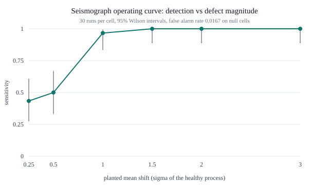

# Seismograph operating curve

embedder: `hashing/dim=256/v1`
healthy process: flip p=0.04, n=40/point, sigma=0.0310 (analytic)
design: baseline 30 points, monitored 40, onset K=15, 30 runs per cell, 95% Wilson intervals

## Detection vs defect magnitude (abrupt mean shift)

| shift | flip p | detected | sensitivity | 95% CI | median latency |
|---|---|---|---|---|---|
| 0.25 sigma | 0.0477 | 13/30 | 0.43 | 0.27-0.61 | 5 |
| 0.5 sigma | 0.0555 | 15/30 | 0.50 | 0.33-0.67 | 5 |
| 1 sigma | 0.0710 | 29/30 | 0.97 | 0.83-0.99 | 5 |
| 1.5 sigma | 0.0865 | 30/30 | 1.00 | 0.89-1.00 | 3 |
| 2 sigma | 0.1020 | 30/30 | 1.00 | 0.89-1.00 | 2 |
| 3 sigma | 0.1330 | 30/30 | 1.00 | 0.89-1.00 | 0 |

## Gradual drift

| ramp to | detected | sensitivity | 95% CI | median latency |
|---|---|---|---|---|
| 1 sigma | 30/30 | 1.00 | 0.89-1.00 | 7 |
| 2 sigma | 30/30 | 1.00 | 0.89-1.00 | 5 |
| 3 sigma | 30/30 | 1.00 | 0.89-1.00 | 3.5 |

## Format flake (p-chart)

| flake rate | detected | sensitivity | 95% CI | median latency |
|---|---|---|---|---|
| 1% | 26/30 | 0.87 | 0.70-0.95 | 6.5 |
| 2% | 30/30 | 1.00 | 0.89-1.00 | 1 |
| 5% | 30/30 | 1.00 | 0.89-1.00 | 0 |
| 10% | 30/30 | 1.00 | 0.89-1.00 | 0 |
| 20% | 30/30 | 1.00 | 0.89-1.00 | 0 |

## Null cells (no planted defect)

- runs: 30, monitored points: 1200
- alarm points: 20
- false alarm rate: **0.0167** (95% CI 0.0108-0.0256)
- runs raising at least one false alarm: 10/30

## What this instrument detects, and what it misses

- Detection floor (lower CI bound >= 0.80): **1 sigma**
- Everything below that magnitude is a documented miss, listed in the table above.

